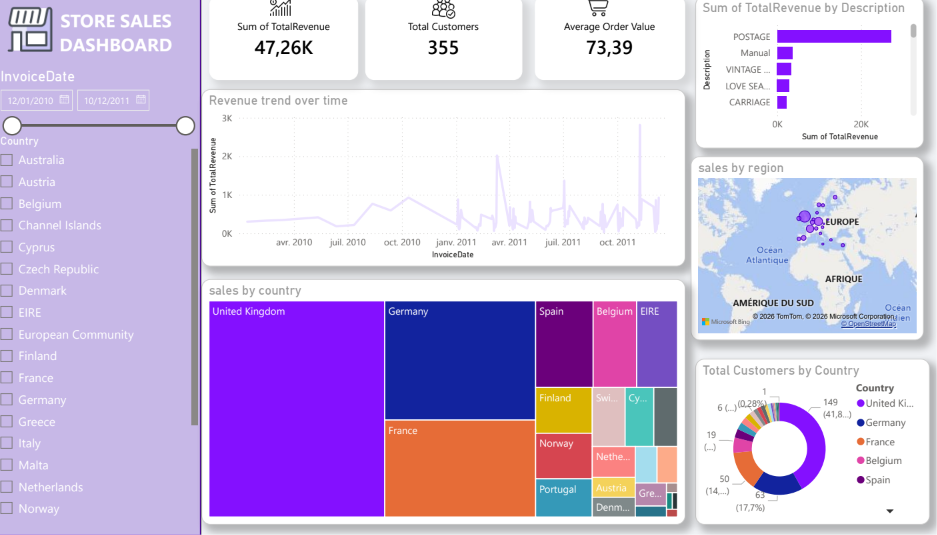

# E-Commerce Sales Analytics Dashboard (Power BI)

An end-to-end Power BI business intelligence project designed with a modern 3D UI/UX look to analyze e-commerce sales performance, customer distribution, and revenue trends.

## Live Preview

## Project Files
- **[Dashboard File (PBIX)](E-Commerce.pbix)**: The original Power BI file containing data models, DAX measures, and visual configurations.
- **[Static Report (PDF)](store%20sales%20dashboard.pdf)**: A downloadable PDF version of the full dashboard.

## Features & Insights
- **Executive KPIs**: Dynamically tracks Total Revenue, Average Order Value, and Total Customers with integrated 3D icons.
- **Sales Trends**: Line chart showcasing revenue fluctuations and peak hours over time.
- **Product Analysis (Treemap)**: Highlights top-performing items by total revenue distribution.
- **Geographical Analysis**: Interactive map showcasing customer segments across global countries.
- **Advanced UI/UX**: Features a custom purple filter sidebar, rounded card containers, and soft 3D shadows for visual depth.

## Tech Stack
- **Power BI Desktop** (Data Modeling, DAX, Visualizations)
- **Excel** (Data Source)
